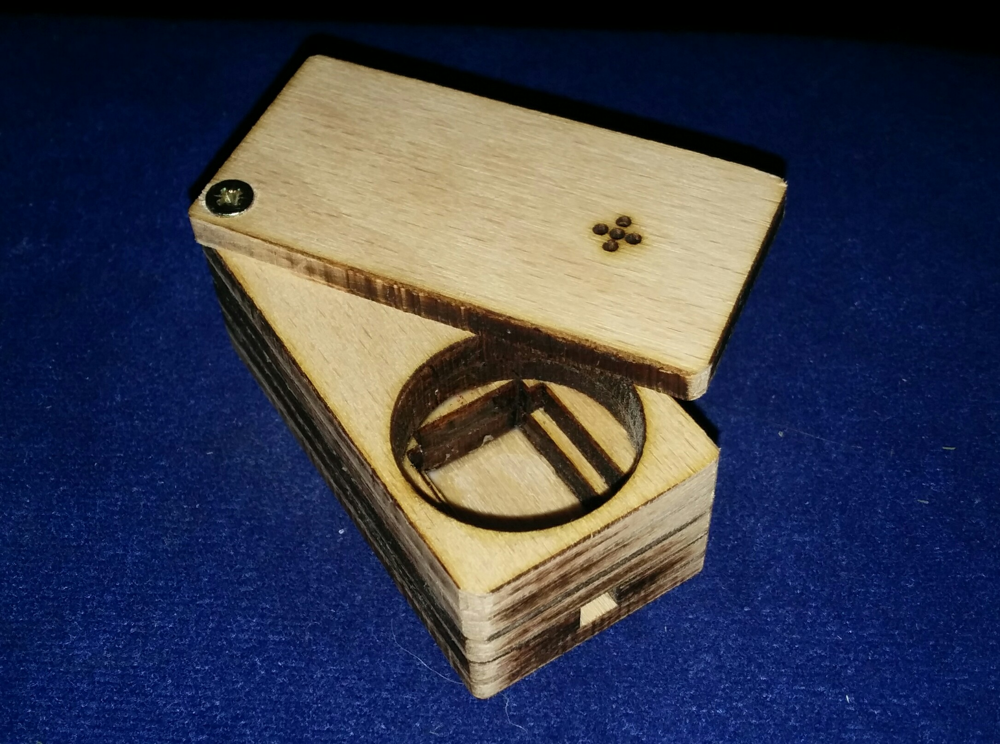

# Morbis Flight Launch Box

Simplified lasercut template similar to the Magic Flight Launch Box (MFLB)

## What you need
* 20mm steel strainer https://www.amazon.de/gp/product/B007Q7UDSO/
* 1.5mm² cupper wire
* AA NiMH rechargeable battery

## Lasercutter instructions
| step  | color  | power    |
| ---   | ---    | ---      |
| **1** | violet | engrave  |
| **2** | red    | half-cut |
| **3** | green  | cut      |
| **4** | black  | cut      |

## Assembly instructions
0. lasercut template (4mm wood)
0. remove marked sections 1.5mm deep
0. combine the bottom 3 plates
0. assemble the wires
0. add the other 3 layers
0. fix the lid with the rest of the wire
0. insert the steel strainer
0. smoke
0. profit!
